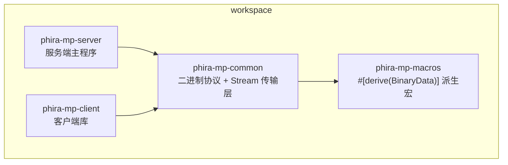
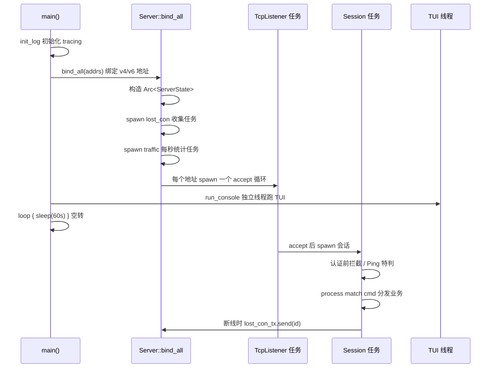

# 网络服务器风格指南

本文档是对 `phira-mp-main` 这个 Rust 异步 TCP 网络服务器的全景总结，逐模块说明其架构、核心模式与编码风格，供后续开发同类网络服务时对照复用。

阅读方式：先看第 1 章建立整体图景，再按需跳读具体模块。每章的「可复用要点」是可直接搬走的经验。

---

## 1. 技术选型与总体架构

### 1.1 工作区分层

项目是一个 Cargo workspace，拆成 4 个 crate，按「协议与传输 / 服务端 / 客户端 / 派生宏」四层职责切分：



- 成员声明与依赖统一在 [Cargo.toml](Cargo.toml#L5-L27)：`members` 列表 + `[workspace.dependencies]` 集中管理版本，子 crate 用 `workspace = true` 继承（见 [phira-mp-server/Cargo.toml](phira-mp-server/Cargo.toml#L6-L27)）。
- `edition = "2024"`；release 用 `opt-level = 2` + `debug = 1`，开发时对依赖包也开 `opt-level = 2`（编译快 + 运行不慢）。

**核心依赖分工**

| 依赖 | 用途 |
| --- | --- |
| `tokio` | 异步运行时、`TcpListener`/`TcpStream`、`mpsc`/`RwLock`/`Mutex`/`Notify`/`OnceCell`/`oneshot` |
| `anyhow` | 全项目统一错误类型 `anyhow::Result` / `bail!` / `?` |
| `tracing` + `tracing-subscriber` + `tracing-appender` | 分级日志、文件滚动、TUI 缓冲 |
| `serde` + `serde_yaml` | 配置读写 |
| `uuid` | 会话 ID |
| `clap` | 命令行参数 |
| `crossterm` + `ratatui` | 运维 TUI |
| `reqwest` | 调用外部 HTTP 服务（认证 / 谱面 / 成绩） |
| `fluent` + `unic-langid` | 多语言 |
| `dashmap`（仅 client） | 并发 map |

### 1.2 进程总览时序



**可复用要点**

- 用「主线程空转 + 各自 spawn 任务」的结构，而不是把所有逻辑塞进一个 select 循环。
- 监听地址在 `main` 里按 `clap` 参数（v4 / v6 / both）展开成 `Vec<SocketAddr>`，`bind_all` 支持一次绑多个地址。

---

## 2. 传输层：`Stream<S, R>`

这是整个项目最值得复用的部件，位于 [phira-mp-common/src/lib.rs](phira-mp-common/src/lib.rs#L40-L204)。

### 2.1 结构

```rust
pub struct Stream<S, R> {
    version: u8,
    send_tx: Arc<mpsc::Sender<S>>,
    sent_bytes: Arc<AtomicU64>,
    recv_bytes: Arc<AtomicU64>,
    send_task_handle: JoinHandle<()>,
    recv_task_handle: JoinHandle<Result<()>>,
    _marker: PhantomData<(S, R)>,
}
```

- 泛型 `S` 是「本端发送的消息」，`R` 是「本端接收的消息」。服务端是 `Stream<ServerCommand, ClientCommand>`，客户端反过来，协议方向天然对称。
- `Arc<mpsc::Sender<S>>` 让 `Stream` 可以只读地共享给多处发送（关键点：`Stream` 本身不持有可变发送端）。
- 两个字节计数原子量，供限流等统计使用。

### 2.2 创建与读写分离

`Stream::new`（[L59-L174](phira-mp-common/src/lib.rs#L59-L174)）的流程：

1. `stream.set_nodelay(true)` 关闭 Nagle。
2. `stream.into_split()` 拆成 `read` / `write` 两半，分别交给两个 `tokio::spawn`。
3. 首个字节是协议版本号（本端 `version: Option<u8>`，有值则写入、无值则读取）。
4. 建 `mpsc::channel(1024)` 作发送队列；`handler` 参数是接收回调 `Box<dyn FnMut(Arc<mpsc::Sender<S>>, R) -> Future>`。

**发送任务**（[L80-L115](phira-mp-common/src/lib.rs#L80-L115)）：从 `send_rx.recv()` 取消息 → `encode_packet` 编码进缓冲 → 写 uleb128 变长长度前缀 → 写正文 → 累加 `sent_bytes`。发送失败只 `error!` 记日志，不 panic。

**接收任务**（[L117-L159](phira-mp-common/src/lib.rs#L117-L159)）：循环读长度前缀（`pos > 32` 判定非法长度）→ `len > 2MB` 直接 `bail!` → `read_exact` 读正文 → `decode_packet` → 解码失败 `warn!("invalid packet")` 并 `break` 断开 → 成功则 `handler(send_tx, payload).await`。

### 2.3 对外的 API

```rust
pub fn version(&self) -> u8
pub fn sent_bytes(&self) -> u64
pub fn recv_bytes(&self) -> u64
pub async fn send(&self, payload: S) -> Result<()>        // 走 mpsc
pub fn blocking_send(&self, payload: S) -> Result<()>     // 同步场景
```

`Drop`（[L199-L204](phira-mp-common/src/lib.rs#L199-L204)）里 abort 两个任务句柄，实现「对象消失即连接任务停止」。

**可复用要点**

- 传输层只做「帧 + 编解码 + 收发任务」，不含任何业务语义，通过泛型 + 回调注入业务。
- 上行（接收）用「回调」而非 channel，回调里可拿到 `send_tx` 直接回包，省掉一层转发。
- 长度前缀用 uleb128，天然省空间且无 32 位对齐烦恼；必须设上限（这里 2MB）防内存攻击。
- 所有 `write`/`read` 错误都转成任务内的 `Result` 或日志，绝不让 IO 错误 panic 整个进程。

---

## 3. 二进制协议与编解码

### 3.1 `BinaryData` trait

[phira-mp-common/src/bin.rs](phira-mp-common/src/bin.rs#L9-L12) 定义：

```rust
pub trait BinaryData: Sized {
    fn read_binary(r: &mut BinaryReader<'_>) -> Result<Self>;
    fn write_binary(&self, w: &mut BinaryWriter<'_>) -> Result<()>;
}
```

`BinaryReader<'a>(&'a [u8], usize)` 是「切片 + 游标」，`byte()`/`take(n)` 越界返回 `unexpected EOF`；`uleb()`（[L44-L55](phira-mp-common/src/bin.rs#L44-L55)）读变长无符号数。`BinaryWriter<'a>(&'a mut Vec<u8>)` 对称地写。

已实现的基础类型：`()`、`i8/u8/u16/u32/u64/i32/i64`（`byteorder` 小端）、`bool`、`f32`、`String`（uleb 长度 + UTF-8）、`Option<T>`、`Result<A,B>`（1 字节标签）、`Vec<T>`、`HashMap<K,V>`、`Uuid`、`DateTime<Utc>`、`(A,B)`。

### 3.2 `#[derive(BinaryData)]` 派生宏

[phira-mp-macros/src/lib.rs](phira-mp-macros/src/lib.rs#L8-L16) 提供派生，规则：

- **struct**：按字段声明顺序依次读写（[L77-L96](phira-mp-macros/src/lib.rs#L77-L96)）。
- **enum**：u8 作为标签，按变体顺序编号；读取时非法编号 `anyhow::bail!("invalid enum: {}", x)`（[L98-L191](phira-mp-macros/src/lib.rs#L98-L191)）。
- **类型识别**：`parse_type` 会剥掉 `Arc<T>`（读时 `.into()`）与 `Vec<T>`（用 `r.array()` 批量读写），因此 `Arc<Vec<TouchFrame>>` 这类字段也能直接派生（[L23-L65](phira-mp-macros/src/lib.rs#L23-L65)、[L198-L210](phira-mp-macros/src/lib.rs#L198-L210)）。

限制：手写 trait 与派生宏都依赖字段顺序稳定，改协议时必须同时改两端。

### 3.3 消息设计范式

[phira-mp-common/src/command.rs](phira-mp-common/src/command.rs) 定义了协议：

- **上行 `ClientCommand`**（[L156-L178](phira-mp-common/src/command.rs#L156-L178)）：`Ping` / `Authenticate` / `Chat` / `Touches` / `Judges` / `CreateRoom` / `JoinRoom` / `LeaveRoom` / `LockRoom` / `CycleRoom` / `SelectChart` / `RequestStart` / `Ready` / `CancelReady` / `Played` / `Abort`。
- **下行 `ServerCommand`**（[L275-L308](phira-mp-common/src/command.rs#L275-L308)）：`Pong`、各请求的应答、以及广播类 `Touches`/`Judges`/`Message`/`ChangeState`/`ChangeHost`/`OnJoinRoom`。
- **业务结果**统一是 `type SResult<T> = Result<T, String>`，直接内嵌在应答变体里，如 `Authenticate(SResult<(UserInfo, Option<ClientRoomState>)>)`、`JoinRoom(SResult<JoinRoomResponse>)`。请求/应答天然配对。
- **房间事件 `Message`**（[L180-L234](phira-mp-common/src/command.rs#L180-L234)）：`Chat`/`CreateRoom`/`JoinRoom`/`LeaveRoom`/`NewHost`/`SelectChart`/`GameStart`/`Ready`/... 包装进 `ServerCommand::Message(Message)` 广播。
- **状态表达**：服务端内部用 `InternalRoomState`（含 `results`/`aborted` 等私有数据），对外用精简的 `RoomState`/`ClientRoomState`，`to_client()` 做映射（房间模块 [L31-L39](phira-mp-server/src/room.rs#L31-L39)）。

### 3.4 边界校验的类型化做法

- `Varchar<const N: usize>(String)`（[L47-L76](phira-mp-common/src/command.rs#L47-L76)）：长度受限字符串。`TryFrom<String>` 超长 `bail!`；编解码时也二次校验。`Authenticate { token: Varchar<32> }`、`Chat { message: Varchar<200> }`。
- `RoomId(Varchar<20>)`（[L78-L123](phira-mp-common/src/command.rs#L78-L123)）：在 `Varchar` 基础上再加「仅允许 `-`、`_`、字母数字且非空」的白名单校验。

**可复用要点**

- 用「受限类型」把校验下沉到类型层，而不是在业务里手写一堆 `if len > N`。
- 协议用「枚举 + 变体携带数据」表达，`match` 天然穷尽，加协议时编译器会提示漏处理。
- 业务错误统一 `Result<T, String>` 回传，服务端 `anyhow` 内部错误在边界处 `.to_string()`。

---

## 4. 服务端全局状态

[phira-mp-server/src/server.rs](phira-mp-server/src/server.rs#L45-L58)：

```rust
pub struct ServerState {
    pub config: ServerConfig,
    pub sessions: IdMap<Arc<Session>>,
    pub users: SafeMap<i32, Arc<User>>,
    pub rooms: SafeMap<RoomId, Arc<Room>>,
    pub lost_con_tx: mpsc::Sender<Uuid>,
    pub ip_access: Arc<IpAccess>,
    pub traffic: Arc<TrafficLimiter>,
    pub maintenance: Arc<Maintenance>,
    pub listen_addrs: Vec<std::net::SocketAddr>,
}
```

其中类型别名在 [main.rs](phira-mp-server/src/main.rs#L37-L49)：

```rust
pub type SafeMap<K, V> = RwLock<HashMap<K, V>>;
pub type IdMap<V> = SafeMap<Uuid, V>;
```

- 全局状态整体用 `Arc<ServerState>` 分发到每个任务，内部各字段各自带锁（粗粒度按模块分锁，而不是一整把大锁）。
- `lost_con_tx` 是「断线事件信道」：任何任务（会话回调、心跳任务、限流任务、TUI）只需 `send(id)`，由唯一的 `lost_con` 收集任务统一处理清理，避免锁竞争与重复逻辑（[L100-L118](phira-mp-server/src/server.rs#L100-L118)）。
- 三个可热更新组件（`ip_access`/`traffic`/`maintenance`）都是「内部 `Arc<RwLock<Config>>`」，外部只持有 `Arc<组件>`。

**可复用要点**

- 共享状态用 `Arc<State>` + 字段级锁；跨模块的「事件」用 channel 解耦，别用共享回调互相调用。

---

## 5. 会话生命周期

核心在 [phira-mp-server/src/session.rs](phira-mp-server/src/session.rs)。

### 5.1 两个对象

- `User`（[L32-L124](phira-mp-server/src/session.rs#L32-L124)）：业务身份，跨重连存活。字段含 `id/name/lang`、`server`、`session: RwLock<Option<Weak<Session>>>`、`room: RwLock<Option<Arc<Room>>>`、`monitor`/`game_time` 原子量、`dangle_mark`。
- `Session`（[L126-L133](phira-mp-server/src/session.rs#L126-L133)）：一次 TCP 连接。字段 `id/stream/user/ip` + `monitor_task_handle`（心跳超时任务）。

关系是「User 弱引用 Session，Session 强引用 User」：连接断了不会拖死 User，User 重连时再绑定新 Session。

### 5.2 生命周期时序

```mermaid
stateDiagram-v2
    [*] --> 接受: listener.accept()
    接受 --> 拒绝: 维护中 或 IP 被拦
    接受 --> 创建: Session::new
    创建 --> 未认证: waiting_for_authenticate = true
    未认证 --> 已认证: Authenticate 成功
    未认证 --> 未认证: Ping/Pong, 其它包忽略
    已认证 --> 已认证: process(cmd) 分发业务
    已认证 --> 断开: 心跳超时 / 发送失败 / 主动
    断开 --> [*]
```

1. `accept`（[server.rs L182-L232](phira-mp-server/src/server.rs#L182-L232)）：先查 `maintenance.is_closed()`，再 `ip_access.check_ip(ip)`，都通过才在 `sessions` 写锁里 `vacant_entry` 取一个不冲突 Uuid 并 `Session::new`。
2. `Session::new`（[L135-L315](phira-mp-server/src/session.rs#L135-L315)）构造。
3. 认证前：`matches!(cmd, ClientCommand::Ping)` 直接回 `Pong`；只有 `Authenticate` 被处理，其它包 `warn!` 忽略。
4. 认证（[L170-L260](phira-mp-server/src/session.rs#L170-L260)）：校验 token 长度 → `GET {HOST}/me`（Bearer token）→ 解析出用户 id/name/language → 若 `users` 里已有同 id 则「重连」复用 User，否则新建 → 发送 `Authenticate(Ok(...))`，`waiting_for_authenticate = false`。失败则回 `Authenticate(Err(msg))` 并 `lost_con_tx.send(id)`。
5. 认证后：`LANGUAGE.scope(user.lang, process(user, cmd))` 注入语言后分发（[L266-L277](phira-mp-server/src/session.rs#L266-L277)）。
6. 断线清理：心跳任务每 `HEARTBEAT_DISCONNECT_TIMEOUT`(10s) 检查 `last_recv`，超时上报 lost_con（[L283-L300](phira-mp-server/src/session.rs#L283-L300)）；`lost_con` 任务移除 session 并调用 `User::dangle()`（[L90-L123](phira-mp-server/src/session.rs#L90-L123)）。

### 5.3 自引用构造技巧（重点）

难点：`Stream` 的接收回调需要「会话自身的 `Arc<Session>`」，但回调是在 `Session::new` 内部构造、此时 `Session` 还没建好。解法是 [L138-L312](phira-mp-server/src/session.rs#L138-L312) 三件套：

- `Arc<OnceCell<Arc<Session>>>`：回调里 `this.get()` 拿自身。
- `Arc<Notify>` `this_inited`：回调等 `Session` 建好后被 `notify_one()` 唤醒，才访问 `this.get()`。
- `oneshot::channel::<Arc<User>>`：回调完成认证后把 User 交给主流程，主流程 `rx.await?` 取出再组装 `Session`。

时序：回调认证成功 → `tx.send(user)` → `this_inited.notified().await` 挂起 → 主流程拿到 user、`Arc::new(Self{..})`、`this.set(res)`、`this_inited.notify_one()` → 回调恢复，`user.set_session(Arc::downgrade(this.get().unwrap()))`。

**可复用要点**

- 需要「异步回调内访问自身 Arc」时，`OnceCell + Notify + oneshot` 是通用解法，不必用 `unsafe` 或提前 `Arc::new_cyclic`（后者无法在 `async` 构造中使用）。
- 心跳超时不直接 kill 连接，而是走与其它断线一致的 lost_con 路径，保证清理逻辑唯一。
- `dangle`（挂起用户）给 10 秒缓冲：如果玩家只是网络抖动会重连，`dangle_mark` 的强计数会在重连时被清空从而取消删除（[L107-L122](phira-mp-server/src/session.rs#L107-L122)）。

---

## 6. 消息分发与业务流程

### 6.1 `process` 分发范式

[L346-L722](phira-mp-server/src/session.rs#L346-L722)：

```rust
async fn process(user: Arc<User>, cmd: ClientCommand) -> Option<ServerCommand> {
    #[inline]
    fn err_to_str<T>(result: Result<T>) -> Result<T, String> {
        result.map_err(|it| it.to_string())
    }
    macro_rules! get_room { ... }
    match cmd {
        ClientCommand::Chat { message } => {
            let res: Result<()> = async move { get_room!(room); room.send_as(&user, message.into_inner()).await; Ok(()) }.await;
            Some(ServerCommand::Chat(err_to_str(res)))
        }
        ...
    }
}
```

三个固定套路：

- **返回值 `Option<ServerCommand>`**：需要回包就 `Some`，纯广播/无需回包就 `None`（如 `Touches`）。
- **业务体放进 `async move { ... }.await` 得到 `Result<T>`**，再用 `err_to_str` 包成 `Result<T, String>` 塞进对应 `ServerCommand`。`?` 与 `bail!` 在业务体里自由使用。
- **`get_room!` 宏**（[L352-L383](phira-mp-server/src/session.rs#L352-L383)）消解「取房间 + 校验状态」的样板：
  - `get_room!(room)`：没有房间则 `bail!("no room")`。
  - `get_room!(~ room)`：没有房间则 `warn!` 后 `return None`（用于 `Touches` 这类无需回包的）。
  - `get_room!(room, InternalRoomState::SelectChart)`：额外校验房间状态，不匹配 `bail!("invalid state")`。

### 6.2 典型业务片段

- `Chat`：`get_room!(room)` → `room.send_as(...)`。
- `Touches`/`Judges`：只有房间 `is_live()` 时才 `tokio::spawn(room.broadcast_monitors(...))`，避免实时数据阻塞主循环。
- `CreateRoom`：先占用空位（`Entry::Vacant/Occupied`），再广播 `Message::CreateRoom`，最后写回 `user.room`。
- `JoinRoom`：多重前置校验（已进房 / 房间不存在 / 已锁 / 非选曲阶段 / 无监看权限 / 满员），成功后 `room.broadcast(OnJoinRoom)` + 回 `JoinRoomResponse`。
- `Played`：先 `GET /record/{id}` 拉成绩并校验 `res.player == user.id`，再写入 `Playing.results`。

### 6.3 房间状态机与广播

[room.rs](phira-mp-server/src/room.rs)：

- 状态（[L18-L39](phira-mp-server/src/room.rs#L18-L39)）：`SelectChart` → `WaitForReady { started }` → `Playing { results, aborted }`，`#[derive(Default)]` 默认选曲阶段。
- 成员用 `RwLock<Vec<Weak<User>>>`，`add_user` 前先 `retain(|it| it.strong_count() > 0)` 清理失效弱引用并判满（`ROOM_MAX_USERS = 8`）。
- `broadcast`（[L164-L174](phira-mp-server/src/room.rs#L164-L174)）遍历成员 + 观测者逐个 `try_send`；`broadcast_monitors` 只发观测者（实时谱面数据）。
- `check_all_ready`（[L233-L292](phira-mp-server/src/room.rs#L233-L292)）：全员 ready 则推进到 `Playing`；全员有结果/放弃则结算、广播 `GameEnd`、回到 `SelectChart`，`cycle` 开启时轮换房主。
- `on_user_leave`（[L193-L224](phira-mp-server/src/room.rs#L193-L224)）：标记 `#[must_use]` 返回「房间是否应被销毁」；房主离开时随机（`rand`）推选新主。

**可复用要点**

- 分发函数保持「薄」：只做参数取用与状态校验，真正的逻辑交给领域对象（`Room`/`User`）的方法。
- 状态机用「枚举携带阶段数据 + 统一 `on_state_change()` 广播」，客户端只需接收 `ChangeState`。
- 广播用 `try_send`（不阻塞），发失败只影响单个会话。

---

## 7. 并发模型与所有权约定

### 7.1 强 / 弱引用分工

| 位置 | 引用方式 | 原因 |
| --- | --- | --- |
| `sessions: IdMap<Arc<Session>>` | 强 | 会话由服务器持有，连接结束才移除 |
| `Session.user: Arc<User>` | 强 | 会话存续期间用户必须存活 |
| `User.session: RwLock<Option<Weak<Session>>>` | 弱 | 用户跨重连存活，不能因旧会话拖住生命周期 |
| `Room.users/monitors: Vec<Weak<User>>` | 弱 | 房间不应影响用户存活；离开/断线自动失效 |

### 7.2 原子量 vs 锁

- 简单标量用原子量：`live`/`locked`/`cycle`（`AtomicBool`）、`monitor`、`game_time`（`AtomicU32` 存 `f32::to_bits`）、`sent_bytes`/`recv_bytes`（`AtomicU64`）。读多写少、无需组合不变量的场景。
- 复合状态用锁：`room.state: RwLock<InternalRoomState>`、`sessions`/`users`/`rooms` 的 `RwLock<HashMap>`。
- `Mutex` 用于极短临界区：`User.dangle_mark`、`last_recv`。

### 7.3 锁的使用纪律

- 读多写少用 `RwLock`，取到数据后尽快 `drop(guard)` 再 await 其它锁，避免锁顺序反转。典型写法：先 `let room = guard.as_ref().map(Arc::clone); drop(guard);` 再操作 `room`（如 [session.rs L92-L95](phira-mp-server/src/session.rs#L92-L95)）。
- 需要「读锁 → 升级判断 → 写锁」时，先 drop 读锁再写，如 `check_all_ready`。
- `blocking_*` 同步访问器只出现在客户端库的便捷方法里，服务端一律 `async`。

### 7.4 `tokio::spawn` 的边界

- 用于「不阻塞当前处理链」的副作用：广播实时帧、TUI 里调用 `set_*` 落盘、延迟清理任务。
- 不用于需要顺序保证的业务逻辑（业务仍在 `process` 内 `await` 完成）。

---

## 8. 配置与持久化

### 8.1 三段式模式

`ip_access.rs`、`traffic.rs` 都遵循同一套：

```rust
#[derive(Debug, Clone, Serialize, Deserialize)]
pub struct XxxConfig { /* 字段 */ }

impl Default for XxxConfig { fn default() -> Self { /* 合理默认值 */ } }

impl XxxConfig {
    pub fn load() -> Self { std::fs::read_to_string("xxx.yml").ok()
        .and_then(|s| serde_yaml::from_str(&s).ok()).unwrap_or_default() }
    pub fn save(&self) -> std::io::Result<()> { std::fs::write("xxx.yml", serde_yaml::to_string(self)?) }
}

pub struct Xxx {
    config: Arc<RwLock<XxxConfig>>,
}
impl Xxx {
    pub fn new() -> Self { Self { config: Arc::new(RwLock::new(XxxConfig::load())) } }
    pub async fn get_config(&self) -> XxxConfig { self.config.read().await.clone() }
    pub async fn set_xxx(&self, v: ...) { let mut c = self.config.write().await; c.xxx = v; let _ = c.save(); }
    pub async fn reload(&self) -> bool { /* 重新读文件覆盖内存 */ }
}
```

关键点：**读文件失败/解析失败一律 `unwrap_or_default()`**，让服务永远能起来；**每次 `set_*` 立即落盘**，保证控制台改动即时生效且重启不丢。

### 8.2 配置文件清单

| 文件 | 结构 | 来源 |
| --- | --- | --- |
| `server_config.yml` | `ServerConfig { monitors: Vec<i32> }` | [server.rs L19-L27](phira-mp-server/src/server.rs#L19-L27)、[L80-L83](phira-mp-server/src/server.rs#L80-L83) |
| `ip_access.yml` | `IpAccessConfig { blacklist, whitelist, whitelist_mode, enabled }` | [ip_access.rs L7-L41](phira-mp-server/src/ip_access.rs#L7-L41) |
| `traffic.yml` | `TrafficConfig { enabled, limit_bps, action }` | [traffic.rs L36-L66](phira-mp-server/src/traffic.rs#L36-L66) |

`ip_access.example.yml` 是给使用者的样例（含匹配规则说明）。

**可复用要点**

- 配置结构体同时 `Deserialize + Serialize`，一份类型既读又写。
- 用 `try_load()` 区分「文件不存在 / 解析失败」与「读到值」，便于 TUI 的 `reload` 返回 `bool` 反馈成功与否。

---

## 9. 运维控制台（TUI）

[console.rs](phira-mp-server/src/console.rs) 用 `ratatui` + `crossterm` 实现一个全功能运维台。

### 9.1 运行模型

- `run_console`（[L686-L698](phira-mp-server/src/console.rs#L686-L698)）单开一个线程，线程内建 `current_thread` 运行时跑 `run_tui`，不干扰主运行时。
- `run_tui`（[L700-L744](phira-mp-server/src/console.rs#L700-L744)）：250ms tick 循环；`event::poll(timeout)` 读键盘事件并分发到 `app.on_*`；到 tick 则 `app.on_tick().await`；每帧 `terminal.draw`。
- Windows 下 `setup_terminal` 调 `GetConsoleWindow`/`ShowWindow` 最大化窗口（[L746-L773](phira-mp-server/src/console.rs#L746-L773)）。

### 9.2 App 状态模式

`App`（[L67-L109](phira-mp-server/src/console.rs#L67-L109)）采用「**缓存快照 + 定时刷新**」而非每次渲染都加锁：

- 字段分两类：交互状态（`active_menu`/`menu_state`/`ip_tab`/`ip_input`/`traffic_sel`/输入模式标志…）与 `cached_*` 快照。
- `on_tick`（[L171-L243](phira-mp-server/src/console.rs#L171-L243)）每次把 `ServerState` 的 sessions/rooms/ip_access/traffic/maintenance 读出来填进 `cached_*`，并处理日志缓冲（保留最近 1000 行）、每 2s 自动 `ip_access.reload()`。
- 渲染函数 `draw_*`（[L786-L1410](phira-mp-server/src/console.rs#L786-L1410)）只读 `cached_*`，不 await、不持锁。
- 写操作（`set_enabled`/`set_limit_bps`/`add_to_blacklist`…）都 `tokio::spawn` 异步执行，UI 立刻改 `cached_*` 并 `show_popup` 提示，避免卡帧。

菜单 8 页：仪表盘 / 会话 / 房间 / 网络 / IP访问控制 / 流量限制 / 服务器 / 日志。IP 页含黑名单、白名单、设置三标签页与「当前连接 IP」可选项（可一键批量加黑白名单）。

**可复用要点**

- TUI 与业务线程解耦：日志经 `TuiLogWriter`（自定义 `MakeWriter`，[main.rs L51-L82](phira-mp-server/src/main.rs#L51-L82)）写入共享缓冲，TUI 线程只读缓冲。
- 「快照 + 定时刷新」是 TUI 访问异步共享状态的稳妥做法：渲染阶段永不阻塞。

---

## 10. 网络防护组件

### 10.1 IP 访问控制

[ip_access.rs](phira-mp-server/src/ip_access.rs)：

- `check_ip`（[L54-L67](phira-mp-server/src/ip_access.rs#L54-L67)）：`enabled=false` 一律放行；白名单模式要求命中白名单；否则只要不命中黑名单即放行。
- `matches_pattern`（[L128-L148](phira-mp-server/src/ip_access.rs#L128-L148)）支持四类规则：`*` 全匹配、`a/b` CIDR、含 `* ? [` 的 glob、以及精确匹配（大小写不敏感）。
- CIDR（[L150-L168](phira-mp-server/src/ip_access.rs#L150-L168)）用整型掩码比较，v4/v6 分别处理并校验前缀范围。
- glob（[L170-L225](phira-mp-server/src/ip_access.rs#L170-L225)）手写回溯匹配，`match_class` 支持 `[a-f]`/`[!a-f]`/`[^a-f]` 字符类，全程转小写比较。
- 增删改（`add_to_blacklist` 等，[L69-L119](phira-mp-server/src/ip_access.rs#L69-L119)）每次操作都 `save()` 落盘，并在加黑名单时自动移出白名单（反之亦然）。

### 10.2 流量限制

[traffic.rs](phira-mp-server/src/traffic.rs) + 统计任务（[server.rs L120-L180](phira-mp-server/src/server.rs#L120-L180)）：

- `TrafficConfig { enabled, limit_bps, action }`，`limit_bps = 0` 表示不限；`ExceedAction` 三档：`Warn`（仅告警）/`Kick`（断开）/`Ban`（断开并封禁）。`label()`/`next()` 专供 TUI 循环切换与展示。
- 统计任务每秒一轮：遍历所有会话取 `recv_bytes`/`sent_bytes`，与上一轮做差得到增量，**按 IP 聚合**（`HashMap<String, u64>`）；首次出现的会话以当前值为基线，避免把历史流量误判为超限。
- 超限处理：`Warn` 只 `warn!`；`Kick`/`Ban` 找出同 IP 的所有会话 id 逐个 `lost_con_tx.send(id)`，`Ban` 额外把 IP 加黑名单。

### 10.3 维护模式

[maintenance.rs](phira-mp-server/src/maintenance.rs)：仅一个 `AtomicBool`。`is_closed()` 在 accept 处拒绝新连接；TUI 关闭时会断开所有现有会话。该状态不持久化，重启即恢复。

**可复用要点**

- 访问控制的「规则匹配」与「配置存储」分离：`matches_pattern` 是纯函数，便于单测；`IpAccess` 只管状态与落盘。
- 限流基于「增量差值 + 按维聚合」，同一套框架可换成按用户、按房间聚合。

---

## 11. 日志与可观测性

- 初始化在 [main.rs L84-L126](phira-mp-server/src/main.rs#L84-L126)：强制确保 `log/` 目录存在 → `LogTracer::init()` 桥接旧 `log` → `tracing_appender::rolling::hourly` 按小时滚动写文件 → 装配三个 layer：
  1. 文件 layer，`DEBUG` 以上；
  2. TUI layer（`TuiLogWriter`），`INFO` 以上只进内存缓冲；
  3. `filter::Targets`，压制 `hyper`/`rustls`/`isahc` 到 `INFO`，其余默认 `TRACE`。
- 分级使用约定：
  - `error!`：发送失败、认证流程内部错误、lost_con 上报失败等需要关注但不应崩溃的情形。
  - `warn!`：非法包、未认证先发包、断线、被拦截的连接、超出流量限制。
  - `info!`：连接建立、房间创建/加入、游戏开始、房主变更等关键业务节点；也用于结构化字段 `info!(user = .., room = .., "msg")`。
  - `debug!`：单条业务细节（选谱、成绩、认证响应等）。
  - `trace!`：每包收发字节、心跳延迟等高频信息（仅文件层保留）。

**可复用要点**

- 用 `tracing` 的结构化字段（`user = id`）而非拼接字符串，便于后续过滤。
- 文件留全量（`DEBUG`）、控制台只留重点（`INFO`）、高频细节用 `TRACE`（只落文件），三档分流。

---

## 12. 编码风格约定

- **缩进**：4 空格，无 tab。
- **模块组织**：每个文件在 [main.rs](phira-mp-server/src/main.rs#L1-L20) 顶部声明 `mod`，非私有的 `pub use module::*` 统一 re-export，外部只见 `crate::Xxx`。
- **类型别名**：复杂泛型抽别名（`SafeMap` / `IdMap` / `SResult` / `Callback` / `RCallback`）。
- **命名**：结构体/枚举 `UpperCamel`，函数/变量 `snake_case`，常量 `SCREAMING_SNAKE`；业务名直白（`check_all_ready`、`on_user_leave`、`vacant_entry`）。
- **错误处理**：内部一律 `anyhow::Result` + `?` + `bail!`；跨协议边界用 `.to_string()` 降为 `String`；IO 失败用 `let _ = ...` 有意忽略。
- **注释**：极少，只在反直觉处标注（如 `/// Return: should the room be dropped`）；用 `#[must_use]` / `#[inline]` 表达契约。
- **`#[derive]` 顺序**：`Debug, Clone, Copy, PartialEq, Eq, Serialize, Deserialize` 等按需组合。
- **注释掉的死代码**：少量保留 TODO（如 `// TODO print results`），不写长篇说明。

---

## 13. 从零搭建同类服务器的骨架

### 13.1 依赖清单

```toml
[workspace.dependencies]
anyhow = { version = "1.0", features = ["backtrace"] }
tokio = { version = "1", features = ["macros","rt-multi-thread","rt","net","io-util","time","sync"] }
tracing = "0.1"
uuid = { version = "1", features = ["v4"] }
```

另按需：`serde` + `serde_yaml`（配置）、`clap`（参数）、`tracing-subscriber` + `tracing-appender`（日志）、`crossterm` + `ratatui`（TUI）、`reqwest`（外部 HTTP）。

### 13.2 目录骨架

```
workspace/
├─ xxx-common/          # 协议 + 传输层
│   └─ src/{lib.rs, bin.rs, command.rs}
├─ xxx-macros/          # #[derive(BinaryData)]
│   └─ src/lib.rs
├─ xxx-server/          # 服务端
│   └─ src/{main.rs, server.rs, session.rs, domain.rs,
│            ip_access.rs, traffic.rs, maintenance.rs, console.rs}
└─ xxx-client/          # 客户端
    └─ src/lib.rs
```

### 13.3 关键骨架

**传输层**（可直接照搬第 2 章）：`Stream<S,R>` = 读写分离 + mpsc 发送 + 回调上行 + uleb128 帧 + 字节计数 + Drop abort。

**协议**：定义 `ClientCommand` / `ServerCommand` 两个枚举，应答型变体内嵌 `Result<T, String>`；实体类型 `#[derive(BinaryData)]`；受限字符串用 `Varchar<N>`。

**全局状态**：`Arc<ServerState>`，字段 `sessions: RwLock<HashMap<Uuid, Arc<Session>>>` 等；跨模块事件用 `mpsc::Sender<Uuid>`。

**会话**：`Session { id, stream, user, ip, monitor_task_handle }`，`new` 里用 `OnceCell + Notify + oneshot` 解决自引用；`process` 用 `match` + `err_to_str` 分发。

**防护**：`IpAccess`（纯函数匹配 + 落盘）、`TrafficLimiter`（每秒增量按维聚合）、`Maintenance`（`AtomicBool`）。

**控制台**：`App`（快照缓存）+ `on_tick`（定时刷新）+ `draw_*`（只读快照）+ 写操作 `tokio::spawn`。

### 13.4 复用优先级

| 优先 | 部件 | 理由 |
| --- | --- | --- |
| 高 | `Stream<S,R>` + `BinaryData` 编解码 | 与业务完全解耦，几乎零改动复用 |
| 高 | 三段式配置组件（load/default/save + reload） | 任何需要运行时热更新配置的服务都适用 |
| 中 | `OnceCell+Notify+oneshot` 自引用构造 | 依赖 async 回调访问自身的场景通用 |
| 中 | IP 访问控制 / 流量限流 | 匹配与聚合逻辑可直接迁移 |
| 低 | TUI 具体页面 | 布局与字段是业务相关，借鉴「快照 + tick」模式即可 |

---

## 附录：核心文件索引

| 关注点 | 文件 |
| --- | --- |
| 传输层 `Stream` | [phira-mp-common/src/lib.rs](phira-mp-common/src/lib.rs) |
| 二进制编解码 | [phira-mp-common/src/bin.rs](phira-mp-common/src/bin.rs) |
| 协议定义 | [phira-mp-common/src/command.rs](phira-mp-common/src/command.rs) |
| 派生宏 | [phira-mp-macros/src/lib.rs](phira-mp-macros/src/lib.rs) |
| 启动与日志 | [phira-mp-server/src/main.rs](phira-mp-server/src/main.rs) |
| 全局状态与 accept | [phira-mp-server/src/server.rs](phira-mp-server/src/server.rs) |
| 会话与分发 | [phira-mp-server/src/session.rs](phira-mp-server/src/session.rs) |
| 房间状态机 | [phira-mp-server/src/room.rs](phira-mp-server/src/room.rs) |
| IP 访问控制 | [phira-mp-server/src/ip_access.rs](phira-mp-server/src/ip_access.rs) |
| 流量限制 | [phira-mp-server/src/traffic.rs](phira-mp-server/src/traffic.rs) |
| 维护模式 | [phira-mp-server/src/maintenance.rs](phira-mp-server/src/maintenance.rs) |
| 运维 TUI | [phira-mp-server/src/console.rs](phira-mp-server/src/console.rs) |
| 多语言 | [phira-mp-server/src/l10n.rs](phira-mp-server/src/l10n.rs) |
| 客户端 | [phira-mp-client/src/lib.rs](phira-mp-client/src/lib.rs) |